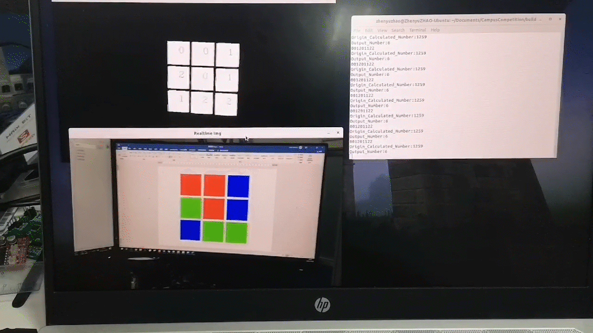

# SJTU RM Campus Competition 2020 CV
 SJTU Robomaster Campus Competion 2020 program for computer vision.

###  Task

Identify the three primary colors of the nine palace grid. 

### Dependencies:

* OPENCV 4.*
* WiringPi (for uart output)

### Performance 

### To be continued

......